# Data-Mining-HW4
# 1.) Clustering and PCA

## PCA

To begin this problem, lets see what we can find from looking merely at
the correlations between the traits of wines using a heatmap:
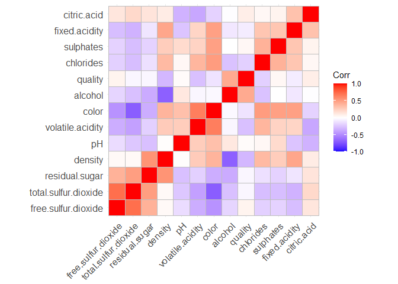

There are some interesting characteristics revealed by the plot above.
We can see that the measurement for residual sugar is highly correlated
with the amount of sulfur dioxide in a wine. Color on the other hand
(coded 1 for reds and 0 for whites), seems to be negatively correlated
with these. This seems to suggest that white wines are sweeter and
contains less sulfur dioxide. Additionally, the quality of a wine seems
to be associated with higher alcohol content and lower values of
volatile acidity.

Now, lets move onto our Principle Components Analysis in order to
predict the quality and color of wines based on their chemical makeup.
We will breakdown our wines into four principle components. Below shows
that these components explain roughly 73% of the proportional variance
in our data:

    ## Importance of first k=4 (out of 11) components:
    ##                           PC1    PC2    PC3     PC4
    ## Standard deviation     1.7407 1.5792 1.2475 0.98517
    ## Proportion of Variance 0.2754 0.2267 0.1415 0.08823
    ## Cumulative Proportion  0.2754 0.5021 0.6436 0.73187

For further investigation, lets look at how each trait factors into each
of our components:

<table>
<thead>
<tr>
<th style="text-align:left;">
Trait
</th>
<th style="text-align:right;">
PC1
</th>
<th style="text-align:right;">
PC2
</th>
<th style="text-align:right;">
PC3
</th>
<th style="text-align:right;">
PC4
</th>
</tr>
</thead>
<tbody>
<tr>
<td style="text-align:left;">
total.sulfur.dioxide
</td>
<td style="text-align:right;">
0.49
</td>
<td style="text-align:right;">
0.09
</td>
<td style="text-align:right;">
0.11
</td>
<td style="text-align:right;">
-0.21
</td>
</tr>
<tr>
<td style="text-align:left;">
free.sulfur.dioxide
</td>
<td style="text-align:right;">
0.43
</td>
<td style="text-align:right;">
0.07
</td>
<td style="text-align:right;">
0.13
</td>
<td style="text-align:right;">
-0.36
</td>
</tr>
<tr>
<td style="text-align:left;">
residual.sugar
</td>
<td style="text-align:right;">
0.35
</td>
<td style="text-align:right;">
0.33
</td>
<td style="text-align:right;">
0.16
</td>
<td style="text-align:right;">
0.17
</td>
</tr>
<tr>
<td style="text-align:left;">
citric.acid
</td>
<td style="text-align:right;">
0.15
</td>
<td style="text-align:right;">
0.18
</td>
<td style="text-align:right;">
-0.59
</td>
<td style="text-align:right;">
-0.26
</td>
</tr>
<tr>
<td style="text-align:left;">
density
</td>
<td style="text-align:right;">
-0.04
</td>
<td style="text-align:right;">
0.58
</td>
<td style="text-align:right;">
0.18
</td>
<td style="text-align:right;">
0.07
</td>
</tr>
<tr>
<td style="text-align:left;">
alcohol
</td>
<td style="text-align:right;">
-0.11
</td>
<td style="text-align:right;">
-0.47
</td>
<td style="text-align:right;">
-0.26
</td>
<td style="text-align:right;">
-0.11
</td>
</tr>
<tr>
<td style="text-align:left;">
pH
</td>
<td style="text-align:right;">
-0.22
</td>
<td style="text-align:right;">
-0.16
</td>
<td style="text-align:right;">
0.46
</td>
<td style="text-align:right;">
-0.41
</td>
</tr>
<tr>
<td style="text-align:left;">
fixed.acidity
</td>
<td style="text-align:right;">
-0.24
</td>
<td style="text-align:right;">
0.34
</td>
<td style="text-align:right;">
-0.43
</td>
<td style="text-align:right;">
0.16
</td>
</tr>
<tr>
<td style="text-align:left;">
chlorides
</td>
<td style="text-align:right;">
-0.29
</td>
<td style="text-align:right;">
0.32
</td>
<td style="text-align:right;">
0.02
</td>
<td style="text-align:right;">
-0.24
</td>
</tr>
<tr>
<td style="text-align:left;">
sulphates
</td>
<td style="text-align:right;">
-0.29
</td>
<td style="text-align:right;">
0.19
</td>
<td style="text-align:right;">
-0.07
</td>
<td style="text-align:right;">
-0.64
</td>
</tr>
<tr>
<td style="text-align:left;">
volatile.acidity
</td>
<td style="text-align:right;">
-0.38
</td>
<td style="text-align:right;">
0.12
</td>
<td style="text-align:right;">
0.31
</td>
<td style="text-align:right;">
0.21
</td>
</tr>
</tbody>
</table>

Above, we can see that PC1 places high positive values on amounts of
sulfur dioxide and high negative values volatile acidity. It is hard to
say explicitly what PC1 is contrasting, but it could be what gives a
wine its appearance. PC2, on the other hand, gives high positive values
to density, residual sugar, and fixed acidity. These seem to contrast a
wine’s flavor characteristics.

Next, by plotting PC1 vs PC2 and shading by color, we can see that PCA
enables us to distinguish the colors of wine based off the features in
our data set:

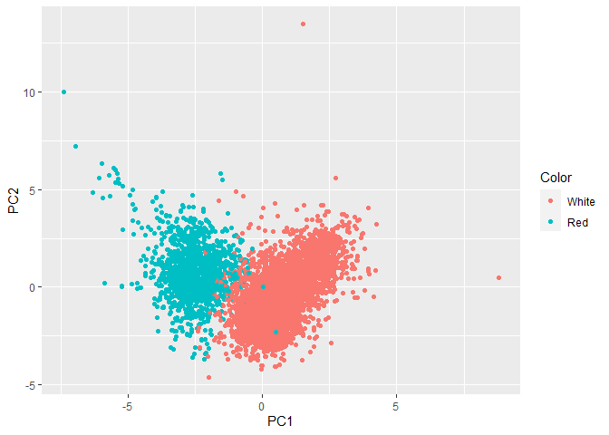

Finally, we will see that the grouping of qualities is nearly
non-existent by plotting PC1 vs PC2 and shading by quality:

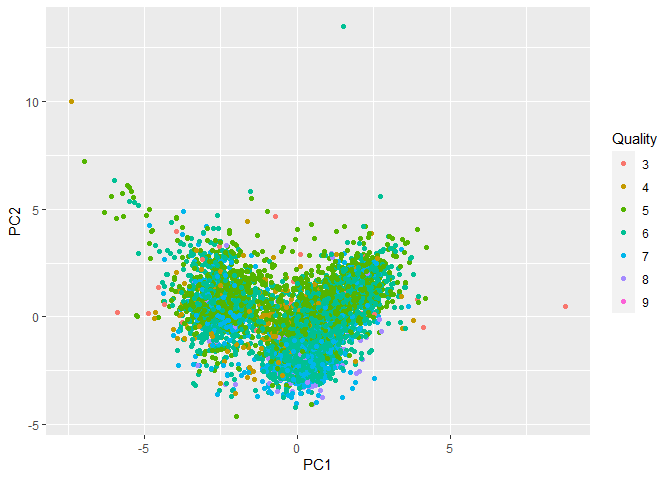

## K-Means Clustering

For our next analysis, we will use K-means to see if we can identify
clusters based off quality and color. To start, we will remove color and
quality from our data set as these are the clusters we are trying to
identify. We will then scale the data to feed in the appropriate
z-scores into our clustering algorithm. To see if we can identify
clusters by color we will set the number of clusters to 2. For quality
the number of clusters will be 7 (even though the ratings are from 1-10,
there are only 7 different rating in our data set). Finally, we will
plot the clusters using various features from our data set and compare
them to plots of the actual quality and color. These plots are displayed
below:

### Color

#### Residual sugar by alcohol content colored by cluster in the first and actual color in the second:

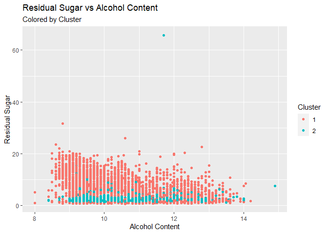

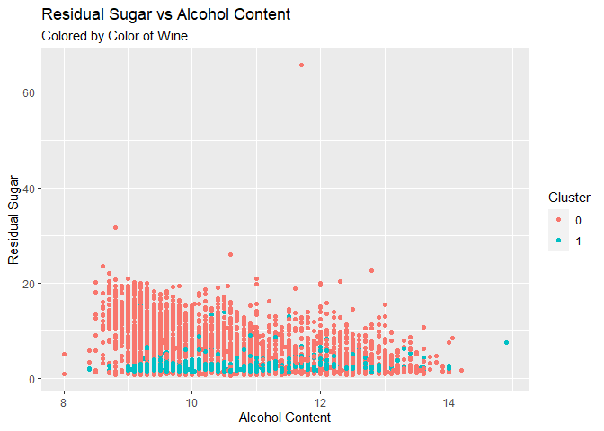

#### Total sulfur dioxide by volatile acidity:

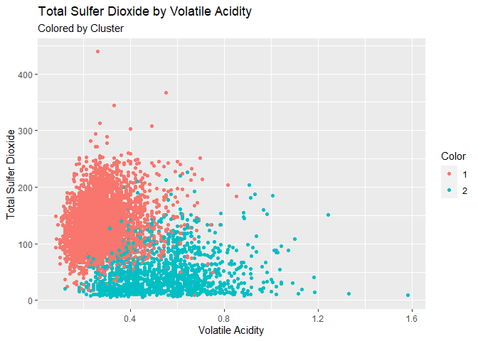

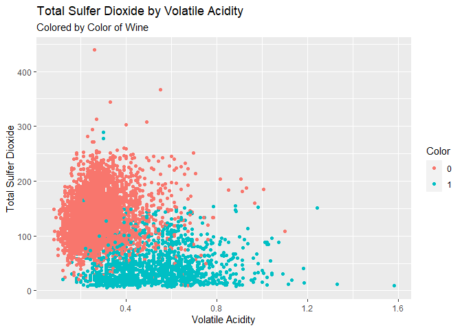

#### Density by citric acid:

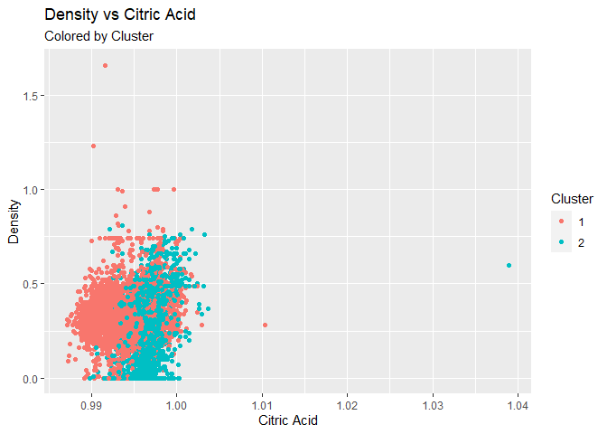

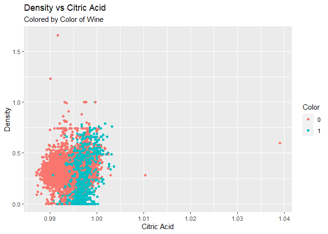

### Quality

#### Residual sugar by alcohol content colored by cluster in the first and actual rating in the second:

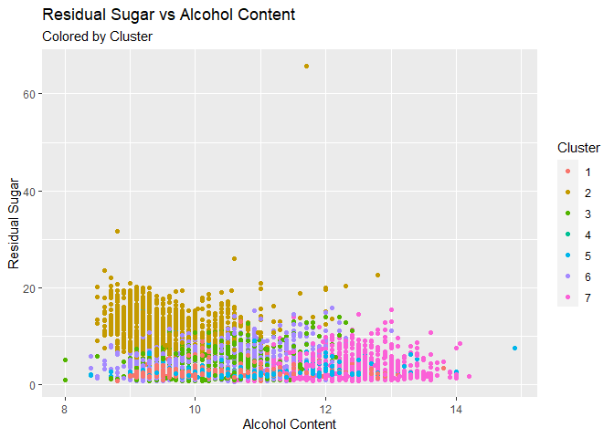

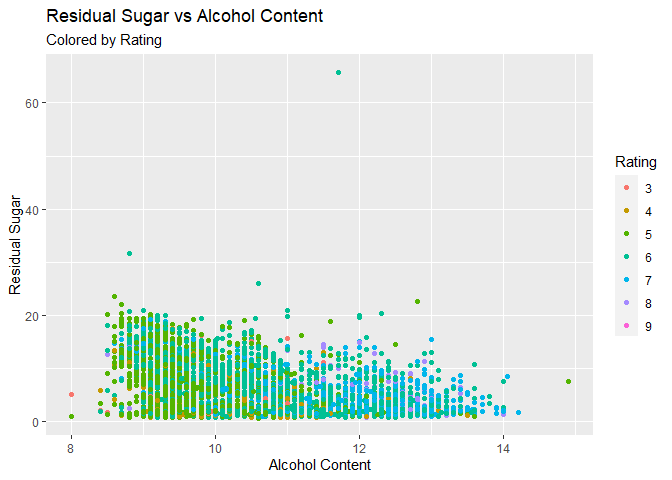

#### Total sulfur dioxide by volatile acidity:

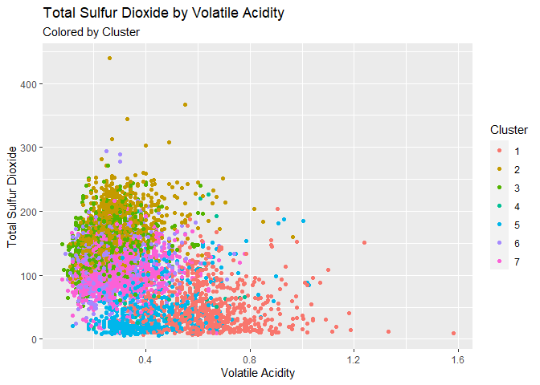

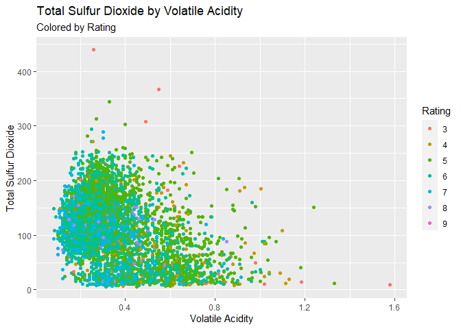

#### Density by citric acid:

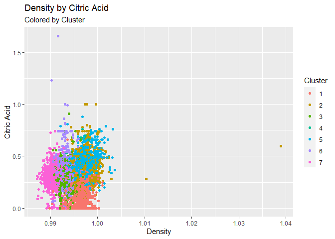

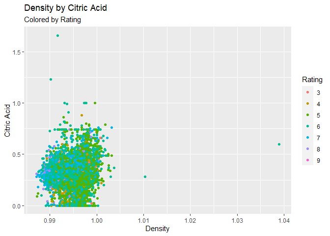

Our plots above suggest that the k-means algorithm does well in
separating clusters by color but does not do well with respect to
quality. This seems to highlight the subjectivity of the quality scores.
Quality scores seem to have a very arbitrary distribution and there is
no clear relationship with the other features in the data set.

## Conclusion

We have seen that both PCA and K-means clustering do well in segmenting
our data by color but not by quality. With this in mind, it makes more
sense to use PCA for our data set when it comes to dimensionality
reduction. By consolidating our covariates into a Euclidian space, PCA
does very well in showing contrasts and the color variable in our data
has two distinct factors we can emphasize. While K-means clustering can
help us see contrasts in data as well, it does so in a classification
space which can sway the definitions of our clusters away from the
actual colors since it is sensitive to sparsity/noise in our data.

# 2.) Market Segmentation

For this analysis, we will try to determine different market segments
utilizing user posts categorized by topic (observations with values for
adult and spam are removed from this data set, along with the columns
for chatter and photo sharing in order to help better identify specific
segments). To begin, let us visualize the correlations in our data set
to help build our intuition as to where clusters may form:

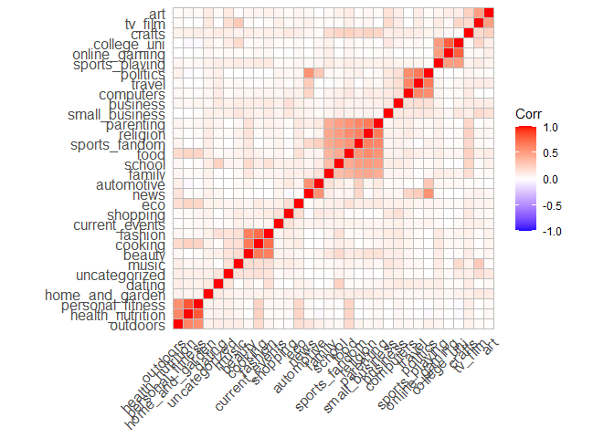

From the plot above we can see that there are some strong associations
based off the sentiment of the post. We can almost identify our clusters
just from this graph. For example, outdoors, personal fitness, and
nutrition all seem to be highly correlated. We can expect certain
clusters will be reflective of correlations such as these. To help us
find the optimal amount of clusters we will refer to the elbow plot
shown below:

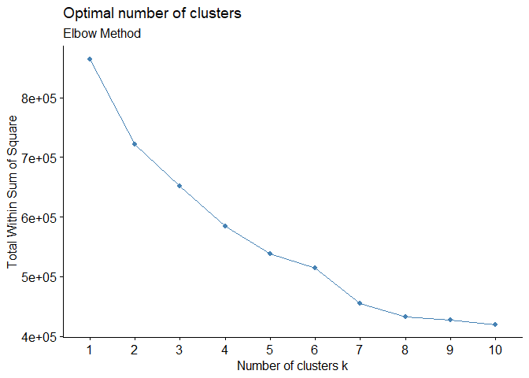

From what we see from this plot, we appear to get the greatest
diminishing returns around seven clusters. This is the amount we will
use going forward.

Now, to help give us some intuition on how the clusters are
distinguished, lets look the clusters’ centers and the five types of
tweets they send the most:

#### Cluster Center 1

    ##                  Center
    ## current_events 1.465566
    ## shopping       1.345112
    ## travel         1.090018
    ## tv_film        1.072479
    ## politics       1.040753

#### Cluster Center 2

    ##              Center
    ## politics   9.594417
    ## travel     6.004926
    ## news       5.187192
    ## computers  2.505747
    ## automotive 2.123153

#### Cluster Center 3

    ##                     Center
    ## health_nutrition 16.904110
    ## personal_fitness  8.224658
    ## cooking           4.575342
    ## outdoors          3.254795
    ## food              2.704110

#### Cluster Center 4

    ##                     Center
    ## cooking          11.620758
    ## fashion           5.564870
    ## beauty            3.748503
    ## shopping          1.866267
    ## health_nutrition  1.834331

#### Cluster Center 5

    ##                     Center
    ## college_uni      10.981132
    ## online_gaming    10.563342
    ## sports_playing    2.541779
    ## health_nutrition  1.579515
    ## cooking           1.544474

#### Cluster Center 6

    ##                 Center
    ## sports_fandom 6.104777
    ## religion      5.224961
    ## food          4.560863
    ## parenting     3.966102
    ## school        2.577812

#### Cluster Center 7

    ##                    Center
    ## health_nutrition 7.735326
    ## personal_fitness 4.075774
    ## cooking          2.225187
    ## outdoors         1.633938
    ## food             1.474920

Our clusters have given us some fairly intuitive results. We could infer
a student classification for the cluster centering with high amounts of
university and online gaming tweets. Furthermore, fitness-buffs are
likely to fall in the cluster associating personal fitness and
nutrition. Going forward, we can assign the users their respective
clusters and market to them accordingly.

# 3.) Association Rules for Grocery Purchases

In this problem, we will explore and analyze various association rules
for grocery purchases. To construct these rules, thresholds will be set
accordingly: support at 0.01 in order to keep items that may not be
purchased much on their own but may be purchased with other goods.
Confidence at 0.2 to help filter out weaker associations. And finally,
the maximum length will be set to 3 to ensure we are accounting for the
bundling of purchases.

Below displays a couple tables of interest:

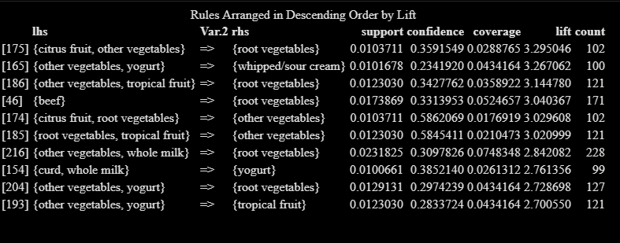

When looking at the above table ordered by lift, we can see that certain
bundles of goods can greatly increase the chances of buying other
particular goods. As an example, when purchasing citrus fruit and other
vegetables, a consumer is much more likely to purchase root vegetables.
This could be the result of the items being located in the same area of
the store, or that they all go into a particular recipe. Another
interesting takeaway from this table is that root vegetables seem to
generally be associated with high amounts of lift. Root vegetables seem
to be purchased with other goods in far greater amounts than on their
own, suggesting they are preferred as recipe components.

Our next table, ordered by confidence, shows us some other interesting
features of grocery purchases. The most notable, is that purchases of
other goods greatly implies purchases of whole milk. This may suggest that whole milk is used in many different recipes or that shoppers are inclined to purchase whole milk on any given trip to the market.  This is accented by whole milk's support level of approximately .26, the highest support level in our rules.

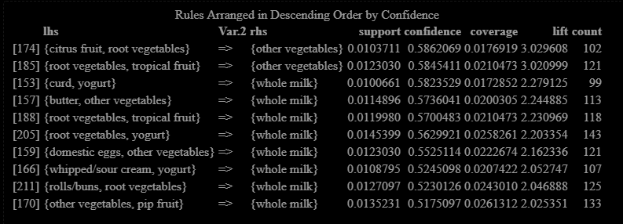

Finally, to visualize these connections, we will construct a network
linking the purchases in our data. Each node will represent an item
purchased and they will be connected by the other items purchased with
them. The size of the nodes will correspond with its degree (in other
words, the number of other goods purchased with it) and the color of the
nodes will be by the modularity class showing the associations:

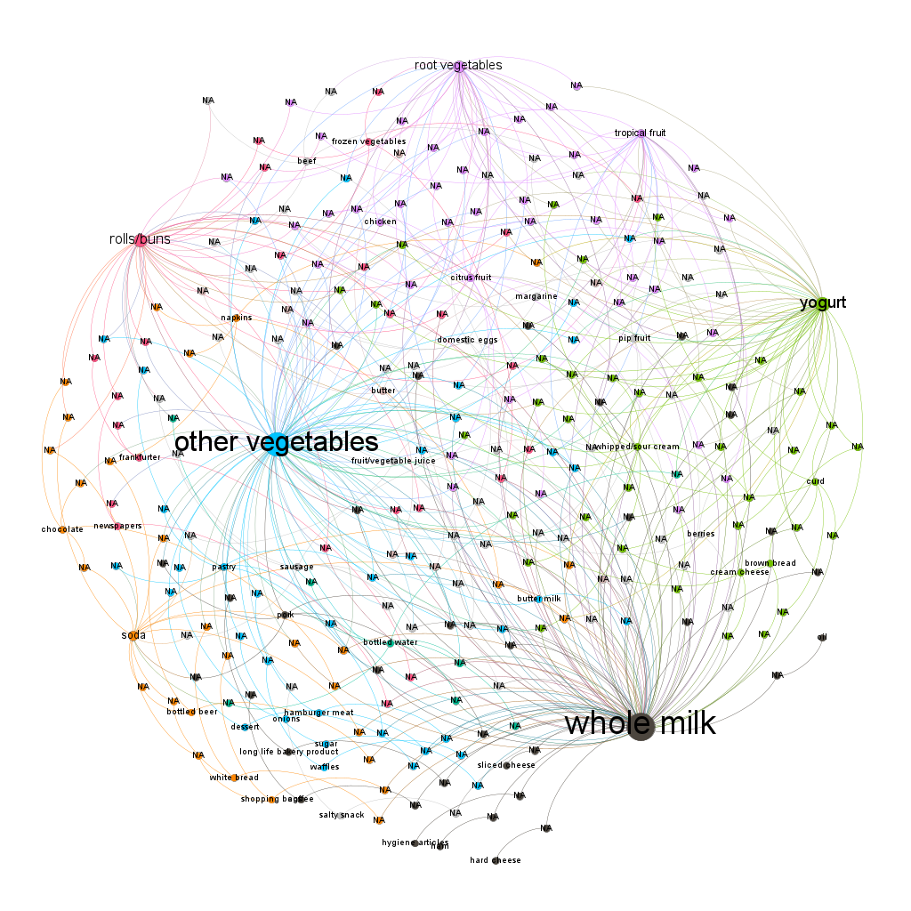

Ultimately, we can
see that whole milk and other vegetables have the greatest number of
connections. Furthermore, there are some distinct groups of items.  We could infer that these groups are common baskets of goods that people purchase to make particular recipes. 
