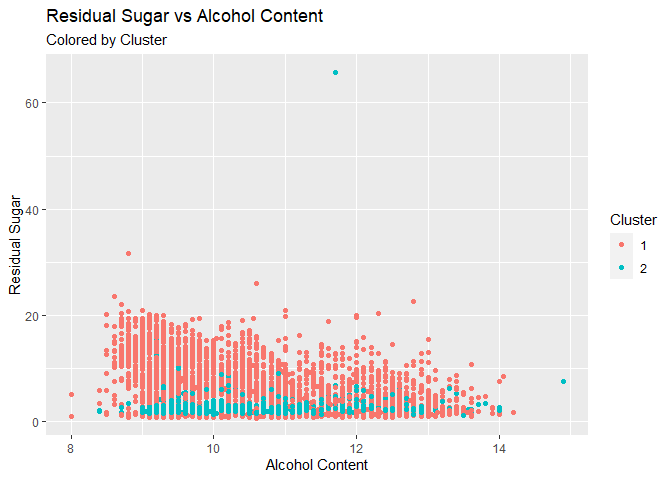
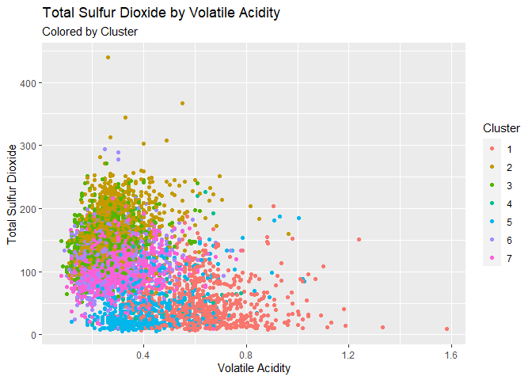

# 1.) Clustering and PCA

## PCA

To begin this problem, lets see what we can find from looking merely at
the correlations between the traits of wines using a heatmap:

There are some interesting characteristics revealed by the plot above.
We can see that the measurement for residual sugar is highly correlated
with the amount of sulfur dioxide in a wine. Color on the other hand
(coded 1 for reds and 0 for whites), seems to be negatively correlated
with these. This seems to suggest that white wines are sweeter and
contains less sulfur dioxide. Additionally, the quality of a wine seems
to be associated with higher alcohol content and lower values of
volatile acidity.

Now, lets move onto our Principle Components Analysis in order to
predict the quality and color of wines based on their chemical makeup.
We will breakdown our wines into four principle components. Below shows
that these components explain roughly 73% of the proportional variance
in our data:

    ## Importance of first k=4 (out of 11) components:
    ##                           PC1    PC2    PC3     PC4
    ## Standard deviation     1.7407 1.5792 1.2475 0.98517
    ## Proportion of Variance 0.2754 0.2267 0.1415 0.08823
    ## Cumulative Proportion  0.2754 0.5021 0.6436 0.73187

For further investigation, lets look at how each trait factors into each
of our components:

<table>
<thead>
<tr>
<th style="text-align:left;">
Trait
</th>
<th style="text-align:right;">
PC1
</th>
<th style="text-align:right;">
PC2
</th>
<th style="text-align:right;">
PC3
</th>
<th style="text-align:right;">
PC4
</th>
</tr>
</thead>
<tbody>
<tr>
<td style="text-align:left;">
total.sulfur.dioxide
</td>
<td style="text-align:right;">
0.49
</td>
<td style="text-align:right;">
0.09
</td>
<td style="text-align:right;">
0.11
</td>
<td style="text-align:right;">
-0.21
</td>
</tr>
<tr>
<td style="text-align:left;">
free.sulfur.dioxide
</td>
<td style="text-align:right;">
0.43
</td>
<td style="text-align:right;">
0.07
</td>
<td style="text-align:right;">
0.13
</td>
<td style="text-align:right;">
-0.36
</td>
</tr>
<tr>
<td style="text-align:left;">
residual.sugar
</td>
<td style="text-align:right;">
0.35
</td>
<td style="text-align:right;">
0.33
</td>
<td style="text-align:right;">
0.16
</td>
<td style="text-align:right;">
0.17
</td>
</tr>
<tr>
<td style="text-align:left;">
citric.acid
</td>
<td style="text-align:right;">
0.15
</td>
<td style="text-align:right;">
0.18
</td>
<td style="text-align:right;">
-0.59
</td>
<td style="text-align:right;">
-0.26
</td>
</tr>
<tr>
<td style="text-align:left;">
density
</td>
<td style="text-align:right;">
-0.04
</td>
<td style="text-align:right;">
0.58
</td>
<td style="text-align:right;">
0.18
</td>
<td style="text-align:right;">
0.07
</td>
</tr>
<tr>
<td style="text-align:left;">
alcohol
</td>
<td style="text-align:right;">
-0.11
</td>
<td style="text-align:right;">
-0.47
</td>
<td style="text-align:right;">
-0.26
</td>
<td style="text-align:right;">
-0.11
</td>
</tr>
<tr>
<td style="text-align:left;">
pH
</td>
<td style="text-align:right;">
-0.22
</td>
<td style="text-align:right;">
-0.16
</td>
<td style="text-align:right;">
0.46
</td>
<td style="text-align:right;">
-0.41
</td>
</tr>
<tr>
<td style="text-align:left;">
fixed.acidity
</td>
<td style="text-align:right;">
-0.24
</td>
<td style="text-align:right;">
0.34
</td>
<td style="text-align:right;">
-0.43
</td>
<td style="text-align:right;">
0.16
</td>
</tr>
<tr>
<td style="text-align:left;">
chlorides
</td>
<td style="text-align:right;">
-0.29
</td>
<td style="text-align:right;">
0.32
</td>
<td style="text-align:right;">
0.02
</td>
<td style="text-align:right;">
-0.24
</td>
</tr>
<tr>
<td style="text-align:left;">
sulphates
</td>
<td style="text-align:right;">
-0.29
</td>
<td style="text-align:right;">
0.19
</td>
<td style="text-align:right;">
-0.07
</td>
<td style="text-align:right;">
-0.64
</td>
</tr>
<tr>
<td style="text-align:left;">
volatile.acidity
</td>
<td style="text-align:right;">
-0.38
</td>
<td style="text-align:right;">
0.12
</td>
<td style="text-align:right;">
0.31
</td>
<td style="text-align:right;">
0.21
</td>
</tr>
</tbody>
</table>

Above, we can see that PC1 places high positive values on amounts of
sulfur dioxide and high negative values volatile acidity. It is hard to
say explicitly what PC1 is contrasting, but it could be what gives a
wine its appearance. PC2, on the other hand, gives high positive values
to density, residual sugar, and fixed acidity. These seem to contrast a
wine’s flavor characteristics.

Next, by plotting PC1 vs PC2 and shading by color, we can see that PCA
enables us to distinguish the colors of wine based off the features in
our data set:

Finally, we will see that the grouping of qualities is nearly
non-existent by plotting PC1 vs PC2 and shading by quality:

## K-Means Clustering

For our next analysis, we will use K-means to see if we can identify
clusters based off quality and color. To start, we will remove color and
quality from our data set as these are the clusters we are trying to
identify. We will then scale the data to feed in the appropriate
z-scores into our clustering algorithm. To see if we can identify
clusters by color we will set the number of clusters to 2. For quality
the number of clusters will be 7 (even though the ratings are from 1-10,
there are only 7 different rating in our data set). Finally, we will
plot the clusters using various features from our data set and compare
them to plots of the actual quality and color. These plots are displayed
below:

### Color Plots

Residual sugar by alcohol content colored by cluster in the first and
actual color in the second:

Total sulfur dioxide by volatile acidity:

Density by citric acid:

### Quality

Residual sugar by alcohol content colored by cluster in the first and
actual color in the second:

Total sulfur dioxide by volatile acidity:

Density by citric acid:

Our plots above suggest that the k-means algorithm does well in
separating clusters by color but does not do well with respect to
quality. This seems to highlight the subjectivity of the quality scores.
Quality scores seem to have a very arbitrary distribution and there is
no clear relationship with the other features in the data set.

## Conclusion

We have seen that both PCA and K-means clustering does well in
segmenting our data by color but not by quality. With this in mind, it
makes more sense to use PCA for our data set when it comes to
dimensionality reduction. By consolidating our covariates into a
Euclidian space, PCA does very well in showing contrasts and the color
variable in our data has two distinct factors we can emphasize. While
K-means clustering can help us see contrasts in data as well, it does so
in a classification space which can be sway the definitions of our
clusters away from the actual colors.

    ## [1] 98.71

# 2.) Market Segmentation

# 3.) Association Rules for Grocery Purchases

In this problem, we will explore and analyze various association rules
for grocery purchases. To construct these rules, thresholds will be set
accordingly: support at 0.01 in order to keep items that may not be
purchased much on their own but may be purchased with other goods.
Confidence at 0.2 to help filter out weaker associations. And finally,
the maximum length will be set to 3 to ensure we are accounting for the
bundling of purchases.

Below displays a couple tables of interest:

    ## Apriori
    ## 
    ## Parameter specification:
    ##  confidence minval smax arem  aval originalSupport maxtime support minlen
    ##         0.2    0.1    1 none FALSE            TRUE       5    0.01      1
    ##  maxlen target  ext
    ##       3  rules TRUE
    ## 
    ## Algorithmic control:
    ##  filter tree heap memopt load sort verbose
    ##     0.1 TRUE TRUE  FALSE TRUE    2    TRUE
    ## 
    ## Absolute minimum support count: 98 
    ## 
    ## set item appearances ...[0 item(s)] done [0.00s].
    ## set transactions ...[169 item(s), 9835 transaction(s)] done [0.01s].
    ## sorting and recoding items ... [88 item(s)] done [0.00s].
    ## creating transaction tree ... done [0.01s].
    ## checking subsets of size 1 2 3 done [0.00s].
    ## writing ... [232 rule(s)] done [0.00s].
    ## creating S4 object  ... done [0.00s].

    ##       lhs                           rhs                     support confidence   coverage      lift count
    ## [1]   {}                         => {whole milk}         0.25551601  0.2555160 1.00000000 1.0000000  2513
    ## [2]   {hard cheese}              => {whole milk}         0.01006609  0.4107884 0.02450432 1.6076815    99
    ## [3]   {butter milk}              => {other vegetables}   0.01037112  0.3709091 0.02796136 1.9169159   102
    ## [4]   {butter milk}              => {whole milk}         0.01159126  0.4145455 0.02796136 1.6223854   114
    ## [5]   {ham}                      => {whole milk}         0.01148958  0.4414062 0.02602949 1.7275091   113
    ## [6]   {sliced cheese}            => {whole milk}         0.01077783  0.4398340 0.02450432 1.7213560   106
    ## [7]   {oil}                      => {whole milk}         0.01128622  0.4021739 0.02806304 1.5739675   111
    ## [8]   {onions}                   => {other vegetables}   0.01423488  0.4590164 0.03101169 2.3722681   140
    ## [9]   {onions}                   => {whole milk}         0.01209964  0.3901639 0.03101169 1.5269647   119
    ## [10]  {berries}                  => {yogurt}             0.01057448  0.3180428 0.03324860 2.2798477   104
    ## [11]  {berries}                  => {other vegetables}   0.01026945  0.3088685 0.03324860 1.5962805   101
    ## [12]  {berries}                  => {whole milk}         0.01179461  0.3547401 0.03324860 1.3883281   116
    ## [13]  {hamburger meat}           => {other vegetables}   0.01382816  0.4159021 0.03324860 2.1494470   136
    ## [14]  {hamburger meat}           => {whole milk}         0.01474326  0.4434251 0.03324860 1.7354101   145
    ## [15]  {hygiene articles}         => {whole milk}         0.01281139  0.3888889 0.03294357 1.5219746   126
    ## [16]  {salty snack}              => {other vegetables}   0.01077783  0.2849462 0.03782410 1.4726465   106
    ## [17]  {salty snack}              => {whole milk}         0.01118454  0.2956989 0.03782410 1.1572618   110
    ## [18]  {sugar}                    => {other vegetables}   0.01077783  0.3183183 0.03385867 1.6451186   106
    ## [19]  {sugar}                    => {whole milk}         0.01504830  0.4444444 0.03385867 1.7393996   148
    ## [20]  {waffles}                  => {other vegetables}   0.01006609  0.2619048 0.03843416 1.3535645    99
    ## [21]  {waffles}                  => {whole milk}         0.01270971  0.3306878 0.03843416 1.2941961   125
    ## [22]  {long life bakery product} => {other vegetables}   0.01067616  0.2853261 0.03741739 1.4746096   105
    ## [23]  {long life bakery product} => {whole milk}         0.01352313  0.3614130 0.03741739 1.4144438   133
    ## [24]  {dessert}                  => {other vegetables}   0.01159126  0.3123288 0.03711235 1.6141636   114
    ## [25]  {dessert}                  => {whole milk}         0.01372649  0.3698630 0.03711235 1.4475140   135
    ## [26]  {cream cheese }            => {yogurt}             0.01240468  0.3128205 0.03965430 2.2424123   122
    ## [27]  {cream cheese }            => {other vegetables}   0.01372649  0.3461538 0.03965430 1.7889769   135
    ## [28]  {cream cheese }            => {whole milk}         0.01647178  0.4153846 0.03965430 1.6256696   162
    ## [29]  {chicken}                  => {root vegetables}    0.01087951  0.2535545 0.04290798 2.3262206   107
    ## [30]  {chicken}                  => {other vegetables}   0.01789527  0.4170616 0.04290798 2.1554393   176
    ## [31]  {chicken}                  => {whole milk}         0.01759024  0.4099526 0.04290798 1.6044106   173
    ## [32]  {white bread}              => {soda}               0.01026945  0.2439614 0.04209456 1.3990437   101
    ## [33]  {white bread}              => {other vegetables}   0.01372649  0.3260870 0.04209456 1.6852681   135
    ## [34]  {white bread}              => {whole milk}         0.01708185  0.4057971 0.04209456 1.5881474   168
    ## [35]  {chocolate}                => {soda}               0.01352313  0.2725410 0.04961871 1.5629391   133
    ## [36]  {chocolate}                => {rolls/buns}         0.01179461  0.2377049 0.04961871 1.2923316   116
    ## [37]  {chocolate}                => {other vegetables}   0.01270971  0.2561475 0.04961871 1.3238103   125
    ## [38]  {chocolate}                => {whole milk}         0.01667514  0.3360656 0.04961871 1.3152427   164
    ## [39]  {coffee}                   => {other vegetables}   0.01342145  0.2311734 0.05805796 1.1947400   132
    ## [40]  {coffee}                   => {whole milk}         0.01870869  0.3222417 0.05805796 1.2611408   184
    ## [41]  {frozen vegetables}        => {root vegetables}    0.01159126  0.2410148 0.04809354 2.2111759   114
    ## [42]  {frozen vegetables}        => {yogurt}             0.01240468  0.2579281 0.04809354 1.8489235   122
    ## [43]  {frozen vegetables}        => {rolls/buns}         0.01016777  0.2114165 0.04809354 1.1494092   100
    ## [44]  {frozen vegetables}        => {other vegetables}   0.01779359  0.3699789 0.04809354 1.9121083   175
    ## [45]  {frozen vegetables}        => {whole milk}         0.02043721  0.4249471 0.04809354 1.6630940   201
    ## [46]  {beef}                     => {root vegetables}    0.01738688  0.3313953 0.05246568 3.0403668   171
    ## [47]  {beef}                     => {yogurt}             0.01169293  0.2228682 0.05246568 1.5976012   115
    ## [48]  {beef}                     => {rolls/buns}         0.01362481  0.2596899 0.05246568 1.4118576   134
    ## [49]  {beef}                     => {other vegetables}   0.01972547  0.3759690 0.05246568 1.9430662   194
    ## [50]  {beef}                     => {whole milk}         0.02125064  0.4050388 0.05246568 1.5851795   209
    ## [51]  {curd}                     => {root vegetables}    0.01087951  0.2041985 0.05327911 1.8734067   107
    ## [52]  {curd}                     => {yogurt}             0.01728521  0.3244275 0.05327911 2.3256154   170
    ## [53]  {curd}                     => {other vegetables}   0.01718353  0.3225191 0.05327911 1.6668288   169
    ## [54]  {curd}                     => {whole milk}         0.02613116  0.4904580 0.05327911 1.9194805   257
    ## [55]  {napkins}                  => {soda}               0.01199797  0.2291262 0.05236401 1.3139687   118
    ## [56]  {napkins}                  => {yogurt}             0.01230300  0.2349515 0.05236401 1.6842183   121
    ## [57]  {napkins}                  => {rolls/buns}         0.01169293  0.2233010 0.05236401 1.2140216   115
    ## [58]  {napkins}                  => {other vegetables}   0.01443823  0.2757282 0.05236401 1.4250060   142
    ## [59]  {napkins}                  => {whole milk}         0.01972547  0.3766990 0.05236401 1.4742678   194
    ## [60]  {pork}                     => {root vegetables}    0.01362481  0.2363316 0.05765125 2.1682099   134
    ## [61]  {pork}                     => {soda}               0.01189629  0.2063492 0.05765125 1.1833495   117
    ## [62]  {pork}                     => {other vegetables}   0.02165735  0.3756614 0.05765125 1.9414764   213
    ## [63]  {pork}                     => {whole milk}         0.02216573  0.3844797 0.05765125 1.5047187   218
    ## [64]  {frankfurter}              => {rolls/buns}         0.01921708  0.3258621 0.05897306 1.7716161   189
    ## [65]  {frankfurter}              => {other vegetables}   0.01647178  0.2793103 0.05897306 1.4435193   162
    ## [66]  {frankfurter}              => {whole milk}         0.02053889  0.3482759 0.05897306 1.3630295   202
    ## [67]  {bottled beer}             => {soda}               0.01698017  0.2108586 0.08052872 1.2092094   167
    ## [68]  {bottled beer}             => {other vegetables}   0.01616675  0.2007576 0.08052872 1.0375464   159
    ## [69]  {bottled beer}             => {whole milk}         0.02043721  0.2537879 0.08052872 0.9932367   201
    ## [70]  {brown bread}              => {yogurt}             0.01453991  0.2241379 0.06487036 1.6067030   143
    ## [71]  {brown bread}              => {other vegetables}   0.01870869  0.2884013 0.06487036 1.4905025   184
    ## [72]  {brown bread}              => {whole milk}         0.02521607  0.3887147 0.06487036 1.5212930   248
    ## [73]  {margarine}                => {yogurt}             0.01423488  0.2430556 0.05856634 1.7423115   140
    ## [74]  {margarine}                => {rolls/buns}         0.01474326  0.2517361 0.05856634 1.3686151   145
    ## [75]  {margarine}                => {other vegetables}   0.01972547  0.3368056 0.05856634 1.7406635   194
    ## [76]  {margarine}                => {whole milk}         0.02419929  0.4131944 0.05856634 1.6170980   238
    ## [77]  {butter}                   => {root vegetables}    0.01291307  0.2330275 0.05541434 2.1378971   127
    ## [78]  {butter}                   => {yogurt}             0.01464159  0.2642202 0.05541434 1.8940273   144
    ## [79]  {butter}                   => {rolls/buns}         0.01342145  0.2422018 0.05541434 1.3167800   132
    ## [80]  {butter}                   => {other vegetables}   0.02003050  0.3614679 0.05541434 1.8681223   197
    ## [81]  {butter}                   => {whole milk}         0.02755465  0.4972477 0.05541434 1.9460530   271
    ## [82]  {newspapers}               => {rolls/buns}         0.01972547  0.2471338 0.07981698 1.3435934   194
    ## [83]  {newspapers}               => {other vegetables}   0.01931876  0.2420382 0.07981698 1.2508912   190
    ## [84]  {newspapers}               => {whole milk}         0.02735130  0.3426752 0.07981698 1.3411103   269
    ## [85]  {domestic eggs}            => {root vegetables}    0.01433655  0.2259615 0.06344687 2.0730706   141
    ## [86]  {domestic eggs}            => {yogurt}             0.01433655  0.2259615 0.06344687 1.6197753   141
    ## [87]  {domestic eggs}            => {rolls/buns}         0.01565836  0.2467949 0.06344687 1.3417510   154
    ## [88]  {domestic eggs}            => {other vegetables}   0.02226741  0.3509615 0.06344687 1.8138238   219
    ## [89]  {domestic eggs}            => {whole milk}         0.02999492  0.4727564 0.06344687 1.8502027   295
    ## [90]  {fruit/vegetable juice}    => {soda}               0.01840366  0.2545710 0.07229283 1.4598869   181
    ## [91]  {fruit/vegetable juice}    => {yogurt}             0.01870869  0.2587904 0.07229283 1.8551049   184
    ## [92]  {fruit/vegetable juice}    => {rolls/buns}         0.01453991  0.2011252 0.07229283 1.0934583   143
    ## [93]  {fruit/vegetable juice}    => {other vegetables}   0.02104728  0.2911392 0.07229283 1.5046529   207
    ## [94]  {fruit/vegetable juice}    => {whole milk}         0.02663955  0.3684951 0.07229283 1.4421604   262
    ## [95]  {whipped/sour cream}       => {root vegetables}    0.01708185  0.2382979 0.07168277 2.1862496   168
    ## [96]  {whipped/sour cream}       => {yogurt}             0.02074225  0.2893617 0.07168277 2.0742510   204
    ## [97]  {whipped/sour cream}       => {rolls/buns}         0.01464159  0.2042553 0.07168277 1.1104760   144
    ## [98]  {whipped/sour cream}       => {other vegetables}   0.02887646  0.4028369 0.07168277 2.0819237   284
    ## [99]  {whipped/sour cream}       => {whole milk}         0.03223183  0.4496454 0.07168277 1.7597542   317
    ## [100] {pip fruit}                => {tropical fruit}     0.02043721  0.2701613 0.07564820 2.5746476   201
    ## [101] {pip fruit}                => {root vegetables}    0.01555669  0.2056452 0.07564820 1.8866793   153
    ## [102] {pip fruit}                => {yogurt}             0.01799695  0.2379032 0.07564820 1.7053777   177
    ## [103] {pip fruit}                => {other vegetables}   0.02613116  0.3454301 0.07564820 1.7852365   257
    ## [104] {pip fruit}                => {whole milk}         0.03009659  0.3978495 0.07564820 1.5570432   296
    ## [105] {pastry}                   => {soda}               0.02104728  0.2365714 0.08896797 1.3566647   207
    ## [106] {pastry}                   => {rolls/buns}         0.02094560  0.2354286 0.08896797 1.2799558   206
    ## [107] {pastry}                   => {other vegetables}   0.02257245  0.2537143 0.08896797 1.3112349   222
    ## [108] {pastry}                   => {whole milk}         0.03324860  0.3737143 0.08896797 1.4625865   327
    ## [109] {citrus fruit}             => {tropical fruit}     0.01992883  0.2407862 0.08276563 2.2947022   196
    ## [110] {citrus fruit}             => {root vegetables}    0.01769192  0.2137592 0.08276563 1.9611211   174
    ## [111] {citrus fruit}             => {yogurt}             0.02165735  0.2616708 0.08276563 1.8757521   213
    ## [112] {citrus fruit}             => {rolls/buns}         0.01677682  0.2027027 0.08276563 1.1020349   165
    ## [113] {citrus fruit}             => {other vegetables}   0.02887646  0.3488943 0.08276563 1.8031403   284
    ## [114] {citrus fruit}             => {whole milk}         0.03050330  0.3685504 0.08276563 1.4423768   300
    ## [115] {shopping bags}            => {soda}               0.02460600  0.2497420 0.09852567 1.4321939   242
    ## [116] {shopping bags}            => {other vegetables}   0.02318251  0.2352941 0.09852567 1.2160366   228
    ## [117] {shopping bags}            => {whole milk}         0.02450432  0.2487100 0.09852567 0.9733637   241
    ## [118] {sausage}                  => {soda}               0.02430097  0.2586580 0.09395018 1.4833245   239
    ## [119] {sausage}                  => {yogurt}             0.01962379  0.2088745 0.09395018 1.4972889   193
    ## [120] {sausage}                  => {rolls/buns}         0.03060498  0.3257576 0.09395018 1.7710480   301
    ## [121] {sausage}                  => {other vegetables}   0.02694459  0.2867965 0.09395018 1.4822091   265
    ## [122] {sausage}                  => {whole milk}         0.02989324  0.3181818 0.09395018 1.2452520   294
    ## [123] {bottled water}            => {soda}               0.02897814  0.2621895 0.11052364 1.5035766   285
    ## [124] {bottled water}            => {yogurt}             0.02297916  0.2079117 0.11052364 1.4903873   226
    ## [125] {bottled water}            => {rolls/buns}         0.02419929  0.2189512 0.11052364 1.1903734   238
    ## [126] {bottled water}            => {other vegetables}   0.02480935  0.2244710 0.11052364 1.1601012   244
    ## [127] {bottled water}            => {whole milk}         0.03436706  0.3109476 0.11052364 1.2169396   338
    ## [128] {tropical fruit}           => {root vegetables}    0.02104728  0.2005814 0.10493137 1.8402220   207
    ## [129] {tropical fruit}           => {yogurt}             0.02928317  0.2790698 0.10493137 2.0004746   288
    ## [130] {yogurt}                   => {tropical fruit}     0.02928317  0.2099125 0.13950178 2.0004746   288
    ## [131] {tropical fruit}           => {rolls/buns}         0.02460600  0.2344961 0.10493137 1.2748863   242
    ## [132] {tropical fruit}           => {other vegetables}   0.03589222  0.3420543 0.10493137 1.7677896   353
    ## [133] {tropical fruit}           => {whole milk}         0.04229792  0.4031008 0.10493137 1.5775950   416
    ## [134] {root vegetables}          => {yogurt}             0.02582613  0.2369403 0.10899847 1.6984751   254
    ## [135] {root vegetables}          => {rolls/buns}         0.02430097  0.2229478 0.10899847 1.2121013   239
    ## [136] {root vegetables}          => {other vegetables}   0.04738180  0.4347015 0.10899847 2.2466049   466
    ## [137] {other vegetables}         => {root vegetables}    0.04738180  0.2448765 0.19349263 2.2466049   466
    ## [138] {root vegetables}          => {whole milk}         0.04890696  0.4486940 0.10899847 1.7560310   481
    ## [139] {soda}                     => {rolls/buns}         0.03833249  0.2198251 0.17437722 1.1951242   377
    ## [140] {rolls/buns}               => {soda}               0.03833249  0.2084024 0.18393493 1.1951242   377
    ## [141] {soda}                     => {whole milk}         0.04006101  0.2297376 0.17437722 0.8991124   394
    ## [142] {yogurt}                   => {rolls/buns}         0.03436706  0.2463557 0.13950178 1.3393633   338
    ## [143] {yogurt}                   => {other vegetables}   0.04341637  0.3112245 0.13950178 1.6084566   427
    ## [144] {other vegetables}         => {yogurt}             0.04341637  0.2243826 0.19349263 1.6084566   427
    ## [145] {yogurt}                   => {whole milk}         0.05602440  0.4016035 0.13950178 1.5717351   551
    ## [146] {whole milk}               => {yogurt}             0.05602440  0.2192598 0.25551601 1.5717351   551
    ## [147] {rolls/buns}               => {other vegetables}   0.04260295  0.2316197 0.18393493 1.1970465   419
    ## [148] {other vegetables}         => {rolls/buns}         0.04260295  0.2201787 0.19349263 1.1970465   419
    ## [149] {rolls/buns}               => {whole milk}         0.05663447  0.3079049 0.18393493 1.2050318   557
    ## [150] {whole milk}               => {rolls/buns}         0.05663447  0.2216474 0.25551601 1.2050318   557
    ## [151] {other vegetables}         => {whole milk}         0.07483477  0.3867578 0.19349263 1.5136341   736
    ## [152] {whole milk}               => {other vegetables}   0.07483477  0.2928770 0.25551601 1.5136341   736
    ## [153] {curd,                                                                                             
    ##        yogurt}                   => {whole milk}         0.01006609  0.5823529 0.01728521 2.2791250    99
    ## [154] {curd,                                                                                             
    ##        whole milk}               => {yogurt}             0.01006609  0.3852140 0.02613116 2.7613555    99
    ## [155] {other vegetables,                                                                                 
    ##        pork}                     => {whole milk}         0.01016777  0.4694836 0.02165735 1.8373939   100
    ## [156] {pork,                                                                                             
    ##        whole milk}               => {other vegetables}   0.01016777  0.4587156 0.02216573 2.3707136   100
    ## [157] {butter,                                                                                           
    ##        other vegetables}         => {whole milk}         0.01148958  0.5736041 0.02003050 2.2448850   113
    ## [158] {butter,                                                                                           
    ##        whole milk}               => {other vegetables}   0.01148958  0.4169742 0.02755465 2.1549874   113
    ## [159] {domestic eggs,                                                                                    
    ##        other vegetables}         => {whole milk}         0.01230300  0.5525114 0.02226741 2.1623358   121
    ## [160] {domestic eggs,                                                                                    
    ##        whole milk}               => {other vegetables}   0.01230300  0.4101695 0.02999492 2.1198197   121
    ## [161] {fruit/vegetable juice,                                                                            
    ##        other vegetables}         => {whole milk}         0.01047280  0.4975845 0.02104728 1.9473713   103
    ## [162] {fruit/vegetable juice,                                                                            
    ##        whole milk}               => {other vegetables}   0.01047280  0.3931298 0.02663955 2.0317558   103
    ## [163] {whipped/sour cream,                                                                               
    ##        yogurt}                   => {other vegetables}   0.01016777  0.4901961 0.02074225 2.5334096   100
    ## [164] {other vegetables,                                                                                 
    ##        whipped/sour cream}       => {yogurt}             0.01016777  0.3521127 0.02887646 2.5240730   100
    ## [165] {other vegetables,                                                                                 
    ##        yogurt}                   => {whipped/sour cream} 0.01016777  0.2341920 0.04341637 3.2670620   100
    ## [166] {whipped/sour cream,                                                                               
    ##        yogurt}                   => {whole milk}         0.01087951  0.5245098 0.02074225 2.0527473   107
    ## [167] {whipped/sour cream,                                                                               
    ##        whole milk}               => {yogurt}             0.01087951  0.3375394 0.03223183 2.4196066   107
    ## [168] {other vegetables,                                                                                 
    ##        whipped/sour cream}       => {whole milk}         0.01464159  0.5070423 0.02887646 1.9843854   144
    ## [169] {whipped/sour cream,                                                                               
    ##        whole milk}               => {other vegetables}   0.01464159  0.4542587 0.03223183 2.3476795   144
    ## [170] {other vegetables,                                                                                 
    ##        pip fruit}                => {whole milk}         0.01352313  0.5175097 0.02613116 2.0253514   133
    ## [171] {pip fruit,                                                                                        
    ##        whole milk}               => {other vegetables}   0.01352313  0.4493243 0.03009659 2.3221780   133
    ## [172] {other vegetables,                                                                                 
    ##        pastry}                   => {whole milk}         0.01057448  0.4684685 0.02257245 1.8334212   104
    ## [173] {pastry,                                                                                           
    ##        whole milk}               => {other vegetables}   0.01057448  0.3180428 0.03324860 1.6436947   104
    ## [174] {citrus fruit,                                                                                     
    ##        root vegetables}          => {other vegetables}   0.01037112  0.5862069 0.01769192 3.0296084   102
    ## [175] {citrus fruit,                                                                                     
    ##        other vegetables}         => {root vegetables}    0.01037112  0.3591549 0.02887646 3.2950455   102
    ## [176] {other vegetables,                                                                                 
    ##        root vegetables}          => {citrus fruit}       0.01037112  0.2188841 0.04738180 2.6446257   102
    ## [177] {citrus fruit,                                                                                     
    ##        yogurt}                   => {whole milk}         0.01026945  0.4741784 0.02165735 1.8557678   101
    ## [178] {citrus fruit,                                                                                     
    ##        whole milk}               => {yogurt}             0.01026945  0.3366667 0.03050330 2.4133503   101
    ## [179] {citrus fruit,                                                                                     
    ##        other vegetables}         => {whole milk}         0.01301474  0.4507042 0.02887646 1.7638982   128
    ## [180] {citrus fruit,                                                                                     
    ##        whole milk}               => {other vegetables}   0.01301474  0.4266667 0.03050330 2.2050797   128
    ## [181] {other vegetables,                                                                                 
    ##        sausage}                  => {whole milk}         0.01016777  0.3773585 0.02694459 1.4768487   100
    ## [182] {sausage,                                                                                          
    ##        whole milk}               => {other vegetables}   0.01016777  0.3401361 0.02989324 1.7578760   100
    ## [183] {bottled water,                                                                                    
    ##        other vegetables}         => {whole milk}         0.01077783  0.4344262 0.02480935 1.7001918   106
    ## [184] {bottled water,                                                                                    
    ##        whole milk}               => {other vegetables}   0.01077783  0.3136095 0.03436706 1.6207825   106
    ## [185] {root vegetables,                                                                                  
    ##        tropical fruit}           => {other vegetables}   0.01230300  0.5845411 0.02104728 3.0209991   121
    ## [186] {other vegetables,                                                                                 
    ##        tropical fruit}           => {root vegetables}    0.01230300  0.3427762 0.03589222 3.1447798   121
    ## [187] {other vegetables,                                                                                 
    ##        root vegetables}          => {tropical fruit}     0.01230300  0.2596567 0.04738180 2.4745380   121
    ## [188] {root vegetables,                                                                                  
    ##        tropical fruit}           => {whole milk}         0.01199797  0.5700483 0.02104728 2.2309690   118
    ## [189] {tropical fruit,                                                                                   
    ##        whole milk}               => {root vegetables}    0.01199797  0.2836538 0.04229792 2.6023653   118
    ## [190] {root vegetables,                                                                                  
    ##        whole milk}               => {tropical fruit}     0.01199797  0.2453222 0.04890696 2.3379305   118
    ## [191] {tropical fruit,                                                                                   
    ##        yogurt}                   => {other vegetables}   0.01230300  0.4201389 0.02928317 2.1713431   121
    ## [192] {other vegetables,                                                                                 
    ##        tropical fruit}           => {yogurt}             0.01230300  0.3427762 0.03589222 2.4571457   121
    ## [193] {other vegetables,                                                                                 
    ##        yogurt}                   => {tropical fruit}     0.01230300  0.2833724 0.04341637 2.7005496   121
    ## [194] {tropical fruit,                                                                                   
    ##        yogurt}                   => {whole milk}         0.01514997  0.5173611 0.02928317 2.0247698   149
    ## [195] {tropical fruit,                                                                                   
    ##        whole milk}               => {yogurt}             0.01514997  0.3581731 0.04229792 2.5675162   149
    ## [196] {whole milk,                                                                                       
    ##        yogurt}                   => {tropical fruit}     0.01514997  0.2704174 0.05602440 2.5770885   149
    ## [197] {rolls/buns,                                                                                       
    ##        tropical fruit}           => {whole milk}         0.01098119  0.4462810 0.02460600 1.7465872   108
    ## [198] {tropical fruit,                                                                                   
    ##        whole milk}               => {rolls/buns}         0.01098119  0.2596154 0.04229792 1.4114524   108
    ## [199] {other vegetables,                                                                                 
    ##        tropical fruit}           => {whole milk}         0.01708185  0.4759207 0.03589222 1.8625865   168
    ## [200] {tropical fruit,                                                                                   
    ##        whole milk}               => {other vegetables}   0.01708185  0.4038462 0.04229792 2.0871397   168
    ## [201] {other vegetables,                                                                                 
    ##        whole milk}               => {tropical fruit}     0.01708185  0.2282609 0.07483477 2.1753349   168
    ## [202] {root vegetables,                                                                                  
    ##        yogurt}                   => {other vegetables}   0.01291307  0.5000000 0.02582613 2.5840778   127
    ## [203] {other vegetables,                                                                                 
    ##        root vegetables}          => {yogurt}             0.01291307  0.2725322 0.04738180 1.9536108   127
    ## [204] {other vegetables,                                                                                 
    ##        yogurt}                   => {root vegetables}    0.01291307  0.2974239 0.04341637 2.7286977   127
    ## [205] {root vegetables,                                                                                  
    ##        yogurt}                   => {whole milk}         0.01453991  0.5629921 0.02582613 2.2033536   143
    ## [206] {root vegetables,                                                                                  
    ##        whole milk}               => {yogurt}             0.01453991  0.2972973 0.04890696 2.1311362   143
    ## [207] {whole milk,                                                                                       
    ##        yogurt}                   => {root vegetables}    0.01453991  0.2595281 0.05602440 2.3810253   143
    ## [208] {rolls/buns,                                                                                       
    ##        root vegetables}          => {other vegetables}   0.01220132  0.5020921 0.02430097 2.5948898   120
    ## [209] {other vegetables,                                                                                 
    ##        root vegetables}          => {rolls/buns}         0.01220132  0.2575107 0.04738180 1.4000100   120
    ## [210] {other vegetables,                                                                                 
    ##        rolls/buns}               => {root vegetables}    0.01220132  0.2863962 0.04260295 2.6275247   120
    ## [211] {rolls/buns,                                                                                       
    ##        root vegetables}          => {whole milk}         0.01270971  0.5230126 0.02430097 2.0468876   125
    ## [212] {root vegetables,                                                                                  
    ##        whole milk}               => {rolls/buns}         0.01270971  0.2598753 0.04890696 1.4128652   125
    ## [213] {rolls/buns,                                                                                       
    ##        whole milk}               => {root vegetables}    0.01270971  0.2244165 0.05663447 2.0588959   125
    ## [214] {other vegetables,                                                                                 
    ##        root vegetables}          => {whole milk}         0.02318251  0.4892704 0.04738180 1.9148326   228
    ## [215] {root vegetables,                                                                                  
    ##        whole milk}               => {other vegetables}   0.02318251  0.4740125 0.04890696 2.4497702   228
    ## [216] {other vegetables,                                                                                 
    ##        whole milk}               => {root vegetables}    0.02318251  0.3097826 0.07483477 2.8420820   228
    ## [217] {soda,                                                                                             
    ##        yogurt}                   => {whole milk}         0.01047280  0.3828996 0.02735130 1.4985348   103
    ## [218] {soda,                                                                                             
    ##        whole milk}               => {yogurt}             0.01047280  0.2614213 0.04006101 1.8739641   103
    ## [219] {other vegetables,                                                                                 
    ##        soda}                     => {whole milk}         0.01392984  0.4254658 0.03274021 1.6651240   137
    ## [220] {soda,                                                                                             
    ##        whole milk}               => {other vegetables}   0.01392984  0.3477157 0.04006101 1.7970490   137
    ## [221] {rolls/buns,                                                                                       
    ##        yogurt}                   => {other vegetables}   0.01148958  0.3343195 0.03436706 1.7278153   113
    ## [222] {other vegetables,                                                                                 
    ##        yogurt}                   => {rolls/buns}         0.01148958  0.2646370 0.04341637 1.4387534   113
    ## [223] {other vegetables,                                                                                 
    ##        rolls/buns}               => {yogurt}             0.01148958  0.2696897 0.04260295 1.9332351   113
    ## [224] {rolls/buns,                                                                                       
    ##        yogurt}                   => {whole milk}         0.01555669  0.4526627 0.03436706 1.7715630   153
    ## [225] {whole milk,                                                                                       
    ##        yogurt}                   => {rolls/buns}         0.01555669  0.2776770 0.05602440 1.5096478   153
    ## [226] {rolls/buns,                                                                                       
    ##        whole milk}               => {yogurt}             0.01555669  0.2746858 0.05663447 1.9690488   153
    ## [227] {other vegetables,                                                                                 
    ##        yogurt}                   => {whole milk}         0.02226741  0.5128806 0.04341637 2.0072345   219
    ## [228] {whole milk,                                                                                       
    ##        yogurt}                   => {other vegetables}   0.02226741  0.3974592 0.05602440 2.0541308   219
    ## [229] {other vegetables,                                                                                 
    ##        whole milk}               => {yogurt}             0.02226741  0.2975543 0.07483477 2.1329789   219
    ## [230] {other vegetables,                                                                                 
    ##        rolls/buns}               => {whole milk}         0.01789527  0.4200477 0.04260295 1.6439194   176
    ## [231] {rolls/buns,                                                                                       
    ##        whole milk}               => {other vegetables}   0.01789527  0.3159785 0.05663447 1.6330258   176
    ## [232] {other vegetables,                                                                                 
    ##        whole milk}               => {rolls/buns}         0.01789527  0.2391304 0.07483477 1.3000817   176

    ## data frame with 0 columns and 0 rows

When looking at the above table ordered by lift, we can see that certain
bundles of goods can greatly increase the chances of buying other
particular goods. As an example, when purchasing citrus fruit and other
vegetables, a consumer is much more likely to purchase root vegetables.
This could be the result of the items being located in the same area of
the store, or that they all go into a particular recipe. Another
interesting takeaway from this table is that root vegetables seem to
generally be associated with high amounts of lift. Root vegetables seem
to be purchased with other goods in far greater amounts than on their
own, suggesting they are preferred as recipe components.

Our next table, ordered by confidence, shows us some other interesting
features of grocery purchases. The most notable, is that purchases of
other goods greatly implies purchases of whole milk.

Finally, to visualize these connections, we will construct a network
linking the purchases in our data. Each node will represent an item
purchased and they will be connected by the other items purchased with
them. The size of the nodes will correspond with its degree (in other
words, the number of other goods purchased with it) and the color of the
nodes will be by the modularity class showing the associations. We can
see that whole milk and other vegetables have the greatest number of
connections. Furthermore, there are some distinct groups of similar
items.
